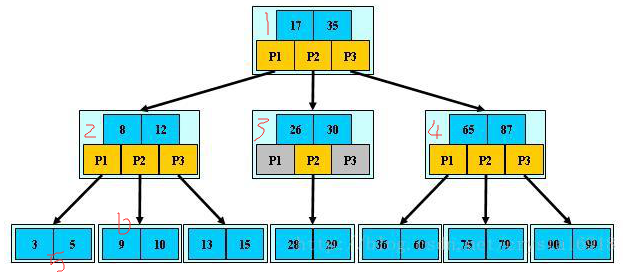

### 索引简介

## mysql 的三种索引类型
* Normal    （普通索引）

`Normal`是最基本的索引，它没有任何限制。  
但是如果是CHAR，VARCHAR类型，length可以小于字段实际长度；  
如果是BLOB和TEXT类型，必须指定 length 。

* Unique    （唯一索引）

唯一索引与前面的普通索引类似，不同的就是：索引列的值必须唯一，但允许有空值。
如果是组合索引，则列值的组合必须唯一。

* Full Text （全文索引）

**注意**  
旧版的MySQL的全文索引只能用在MyISAM表格的char、varchar和text的字段上。 
不过新版的MySQL5.6.24上InnoDB引擎也加入了全文索引。全文索引的使用 较为复杂，本篇博文不详细展开说明。

## mysql 索引方法

BTree 和 Hash 是最常见的索引方法

####* BTree  实际上就是B+树  
BTree可以不仅可以被用在`=,>,>=,<,<=`和`between`这些比较操作符上，而且还可以用于`like`操作符，
只要它的查询条件是一个不以通配符开头的常量。
   
假如存在数据 3 5 9 10 13 15 28 29 36 60 75 79 90 99   
B+树的结构如下所示  
  
* B+树结构简介  
一颗b+树，浅蓝色的块称之为一个磁盘块，可以看到每个磁盘块包含几个数据项(深蓝色所示)
和指针(黄色所示)，如磁盘块1包含数据项17和35，包含指针P1, P2, P3, P1表示
小于17的磁盘块，P2表示在17和35之间的磁盘块，P3表示大于35的磁盘块。  
真实的数据存在于叶子节点 即3，5，9，10 13……  
非叶子节点只不存储真实的数据，只存储指引搜索方向的数据项，如图17，35并不真实存在于数据表中。

* 查找过程  
如果要查找数据项9，那么首先会把磁盘块1由磁盘加载到内存，此时发生一次IO，
在内存中用二分查找确定9在0和17之间，锁定磁盘块1的P1指针，内存时间因为非常短(相比于磁盘的IO)可以忽略不计。
通过磁盘块1的P2指针的磁盘地址把磁盘块3由磁盘加载到内存，发生第二次IO, 9在8和12之前，锁定磁盘块2的P2指针。
通过指针加载磁盘块6到内存，发生第三次IO，同时内存中做二分查找找到9，结束查询，总计三次IO。

####* Hash索引

Hash索引只能用于对等比较，例如`=,<=>（相当于=）`操作符。对`<= >=`的支持性不好
由于是一次定位数据，不像BTree索引需要从根节点到枝节点，最后才能访问到页节点这样多次IO访问，
所以检索效率远高于BTree索引。  

**Hash索引的弊端**

    1. Hash索引仅仅能满足“=”,“IN”,“<=>”查询，不能使用范围查询。 
    2. 联合索引中，Hash索引不能利用部分索引键查询。 
    对于联合索引中的多个列，Hash是要么全部使用，要么全部不使用，并不支持BTree支持的联合索
    引的最优前缀，也就是联合索引的前面一个或几个索引键进行查询时，Hash索引无法被利用。 
    3. Hash索引无法避免数据的排序操作 
    由于Hash索引中存放的是经过Hash计算之后的Hash值，
    而且Hash值的大小关系并不一定和Hash运算前的键值完全一样，
    所以数据库无法利用索引的数据来避免任何排序运算。 
    4. Hash索引任何时候都不能避免表扫描 
    Hash索引是将索引键通过Hash运算之后，将Hash运算结果的Hash值和所对应的行指针信息
    存放于一个Hash表中，由于不同索引键存在相同Hash值，所以即使满足某个Hash键值的数据的记
    录条数，也无法从Hash索引中直接完成查询，还是要通过访问表中的实际数据进行比较，并得到相应的结果。 
    5. Hash索引遇到大量Hash值相等的情况后性能并不一定会比BTree高 
    对于选择性比较低的索引键，如果创建Hash索引，那么将会存在大量记录指针信息存于同一个Hash值相关联。
    这样要定位某一条记录时就会非常麻烦，会浪费多次表数据访问，而造成整体性能底下。

