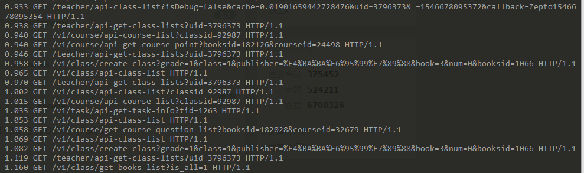

## 记录一次查看慢接口的过程

### 前情介绍

组长要求每个接口的响应速度在300ms之内。  
所以优化思路就是先找出慢的接口，然后针对接口优化。  

### 找出慢接口
`nginx`日志可以记录每个接口的地址和响应时间，可以通过统计日志的方法来找到慢接口 
```bash
ps aux | grep nginx    
```
查看nginx进程使用的配置文件,如果没有的话那就是在默认的位置  /etc/nginx/  目录下。  
查看 `log_format` 的配置。
比如我的配置是
```
log_format access '$remote_addr - $remote_user [$time_local] "$request" '
                      '$status $body_bytes_sent "$http_referer" '
                      '"$http_user_agent" "$http_x_forwarded_for" '
                      '"$request_time" "$upstream_response_time" ';
``` 
```bash
125.34.6.62 
- - 
[05/Jan/2019:10:51:56 +0800] 
"GET /v1/course/api-get-course-point?booksid=182107&courseid=28950 HTTP/1.1" 
200 
144
"http://t.limixuexi.com/unitcourse?classId=92446&origin=selectclass&navTitle=" 
"Mozilla/5.0 (iPhone; CPU iPhone OS 12_0 like Mac OS X) AppleWebKit/605.1.15 (KHTML, like Gecko) Mobile/16A366 MicroMessenger/7.0.1(0x17000120) NetType/WIFI Language/zh_CN" 
"-" 
"0.208" 
"0.208"
```

可以看到 日志可以用 `"` 分割通过`awk`来处理下,然后用`sort`排序 还可以加上`head`获取前几条
```bash
 awk -F "\"" '{print $10,$2}' api.teacher.fudaodashi.com-access.log | sort -r -n 
```




查询某秒请求数量
```
awk -F '"' -v OFS="  "  '{arr[$16]++} END{for (i in arr) {print arr[i], i}} ' bd.limiketang.com.access.log | sort -r -n | head -n 10
```

  
  
  


