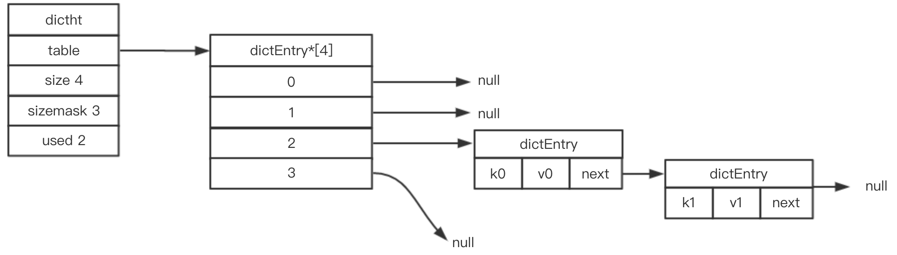

# 1.0 SDS
## C字符串和SDS的区别

| C字符串 | SDS | 
| ------ | -------------------------- | 
| 获取字符串长度发复杂度为O(N) | 获取字符串长度发复杂度为O(1) |
| API不安全，可能会[缓冲区溢出](#缓冲区溢出) | API是安全的不会缓冲区溢出 |
| 修改字符串长度必然需要执行N次内存分配 | 修改字符串长度最多需要执行N次内存分配 |
| 只能存文本数据| 可以存文本或者二进制数据 |
| 可以使用所有的<string.h>的函数| 可以使用部分的<string.h>的函数 |
|  | 惰性内存释放，也有相应的API不用担心内存浪费 |

缓冲区溢出

当C字符串容纳大于自己长度的内容时，就会发生缓冲区溢出， 影响内存块的数据

-----

# 1.1  链表
## 链表的特点
- Reids的列表键、发布与订阅、慢查询、监视器都是基于链表做的
- 每个链表节点由一个listNode结构，每个节点标记了前置节点，后置节点的指针，双向链表，无环链表。
- Redis的链表可以保存各种不同的类型的值。
- 链表list结构len属性可以标记链表的长度。

------

# 1.2 字典

基本结构Redis的字典是使用哈希表做底层实现的，  hashtable + 单链表  链表解决hash冲突

rehash 扩容、收缩  
原来的数据在 ht[0]->table 中，新建一个扩容或者收缩的 ht[1]; ht[1]的大小是以前的两倍，然后讲 原ht[0]的数据， [渐进式rehash](#渐进式rehash) 放到ht[1]中。当数据全部转移完之后，释放ht[0], ht[1]变成ht[0]。  

什么时候会执行rehash   
// 负载因子  load_factor = ht[0].size/ht[0].used  
1 执行BGSAVE的时候，负载因子 > 5 才会执行，是因为执行BGSAVE的时候， Reids会创建子进程，并且大部分操作系统会采取写时复制(copy-on-write)来提高子进程的使用效率，所以为了避免在有子进程的时候rehash,避免写内存的操作，提高了负载因子的值。  
2 未执行BGSAVE的时候，负载因子 > 1 的时候会执行， 或者负载因子 < 0.1执行收缩。 

渐进式rehash

数据从ht[0]到ht[1]的过程不是一次性写入的，是分多次，渐进式完成的。`字典dict`有个字段 rehashidx 设置为0表示是在rehash状态，每次对字典读写删除更新等操作时，会把对应的数据转移到ht[1],最终在某个时间，rehash结束。rehash过程中， 新增的部分会直接写到ht[1],

其他知识点  
- 字典实现了redis的数据库和哈希键
- redis字典有两个hashtable ,一个平常的时候用， 一个rehash的时候用
- redis使用了MurmurHash2算法来计算键的hash值
- 使用链地址法解决hash冲突，是个单链表

# 1.3 跳跃表

跳表是一种有序的数据结构，大部分情况下查找效率可以和平衡树媲美，并且实现起来比平衡树简单。redis 只在zset 和集群节点中用作内部数据结构。 
- `zskiplist跳表`是`zset`的底层实现之一， 另一个实现是 `ziplist压缩列表` 
- 创建节点的时候随机生成一个1~32的值作为层高
- 跳表的节点按照分值（`跳表节点scorez字段`）大小排序。分值相同时按成员对象大小排序

# 1.4整数集合
`intset`整数集合是 `set`的底层实现之一（`set`本身是无序的， 但是`intset`有序），当set集合中只包含数值元素，并且集合的元素数量不多的时候。
内部结构的C语言的数组。