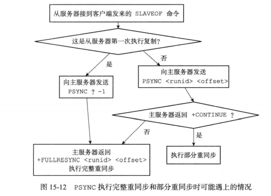

# 1.0 SDS
## C字符串和SDS的区别

| C字符串 | SDS | 
| ------ | -------------------------- | 
| 获取字符串长度发复杂度为O(N) | 获取字符串长度发复杂度为O(1) |
| API不安全，可能会[缓冲区溢出](#缓冲区溢出) | API是安全的不会缓冲区溢出 |
| 修改字符串长度必然需要执行N次内存分配 | 修改字符串长度最多需要执行N次内存分配 |
| 只能存文本数据| 可以存文本或者二进制数据 |
| 可以使用所有的<string.h>的函数| 可以使用部分的<string.h>的函数 |
|  | 惰性内存释放，也有相应的API不用担心内存浪费 |


<div id = "缓冲区溢出">缓冲区溢出</div>
当C字符串容纳大于自己长度的内容时，就会发生缓冲区溢出， 影响内存块的数据


-----

# 1.1  链表
## 链表的特点
- Reids的列表键、发布与订阅、慢查询、监视器都是基于链表做的
- 每个链表节点由一个listNode结构，每个节点标记了前置节点，后置节点的指针，双向链表，无环链表。
- Redis的链表可以保存各种不同的类型的值。
- 链表list结构len属性可以标记链表的长度。

------

# 1.2 字典

基本结构Redis的字典是使用哈希表做底层实现的，  hashtable + 单链表  链表解决hash冲突

rehash 扩容、收缩  
原来的数据在 ht[0]->table 中，新建一个扩容或者收缩的 ht[1]; ht[1]的大小是以前的两倍，然后讲 原ht[0]的数据， [渐进式rehash](#渐进式rehash) 放到ht[1]中。当数据全部转移完之后，释放ht[0], ht[1]变成ht[0]。  

什么时候会执行rehash   
// 负载因子  load_factor = ht[0].size/ht[0].used  
1 执行BGSAVE的时候，负载因子 > 5 才会执行，是因为执行BGSAVE的时候， Reids会创建子进程，并且大部分操作系统会采取[写时复制](../Linux/写时复制.md)(copy-on-write)来提高子进程的使用效率，所以为了避免在有子进程的时候rehash,避免写内存的操作，提高了负载因子的值。  
2 未执行BGSAVE的时候，负载因子 > 1 的时候会执行， 或者负载因子 < 0.1执行收缩。 

<div id = "渐进式rehash">渐进式rehash</div>
数据从ht[0]到ht[1]的过程不是一次性写入的，是分多次，渐进式完成的。`字典dict`有个字段 rehashidx 设置为0表示是在rehash状态，每次对字典读写删除更新等操作时，会把对应的数据转移到ht[1],最终在某个时间，rehash结束。rehash过程中， 新增的部分会直接写到ht[1],

其他知识点  
- 字典实现了redis的数据库和哈希键
- redis字典有两个hashtable ,一个平常的时候用， 一个rehash的时候用
- redis使用了MurmurHash2算法来计算键的hash值
- 使用链地址法解决hash冲突，是个单链表

--------------
# 1.3 跳跃表

跳表是一种有序的数据结构，大部分情况下查找效率可以和平衡树媲美，并且实现起来比平衡树简单。redis 只在zset 和集群节点中用作内部数据结构。 
- `zskiplist跳表`是`zset`的底层实现之一， 另一个实现是 `ziplist压缩列表` 
- 创建节点的时候随机生成一个1~32的值作为层高
- 跳表的节点按照分值（`跳表节点score字段`）大小排序。分值相同时按成员对象大小排序
- 跳表节点score字段 是16位 double 类型的浮点数

----------------

# 1.4整数集合
`intset`整数集合是 `set`的底层实现之一（`set`本身是无序的， 但是`intset`有序），当set集合中只包含数值元素，并且集合的元素数量不多(读配置set-max-intset-entries，默认是512)的时候。
内部结构的C语言的数组。  

升级  
- 提升整数集合的灵活性，可以同时储存int16_t 、 int32_t 或者 int64_t的值，
- 节约内存，仅在有需要的时候升级。按数值最大的类型来储存。
特点
- 底层实现是整型数组，有整型数组的所有优点
- 也做了优化，记录了数组的大小，可以O(1)获取集合长度， 随机返回值，获取集合内存大小。
- 查找元素是否存在， 因为有排序，可以使用二分查找。
- 缺点， 新增、删除复杂度是 O(n)。
--------------
# 1.5压缩列表

压缩列表（ziplist）是列表键（list）和哈希键(hash)的底层实现之一。
- 列表键只包含少量列表项， 并且每个列表项要么就是小整数值， 要么就是长度比较短的字符串
- 当一个哈希键只包含少量键值对， 并且每个键值对的键和值要么就是小整数值， 要么就是长度比较短的字符串

特点
- 压缩列表是一种节约内存的而开发的顺序性内存结构
- 压缩列表（ziplist）是列表键（list）和哈希键(hash)的底层实现之一。
- 压缩列表可以存储多个节点，每个节点可以存储一个字节数组或者整数值
- 当新增或者删除的时候，可能会引发连锁更新操作，但是出现的概率不高。
连锁更新会出现在多个连续的，长度介于250~253字节的节点
---------

# 1.7 快速列表quicklist
快速列表quicklist是3.2版本新增的list编码，是由ziplist组成的双向链表。
- 插入、删除操作非常方便复杂度为O(n),但是不需要内存复制，提高了效率访问两端元素复杂度为O(1)
- 微观上quicklist由一片片entry节点组成，每一片entry节点内存连续且顺序储存数据
-------
# 1.8对象
redis内部有5中对象对应redis可用的数据结构 `string` `list` `hash` `set` `zset`,每个对象对应不同的8种编码实现,redis可以根据使用场景来选择不同的数据结构，提高了灵活性和效率

编码常量| 编码所对应的底层数据结构
--| -- 
REDIS_ENCODING_INT	|long 类型的整数
REDIS_ENCODING_EMBSTR	|embstr 编码的简单动态字符串
REDIS_ENCODING_RAW|	简单动态字符串
REDIS_ENCODING_HT	|字典
REDIS_ENCODING_LINKEDLIST|	双端链表
REDIS_ENCODING_QUICKLIST|	快速链表
REDIS_ENCODING_ZIPLIST	|压缩列表
REDIS_ENCODING_INTSET|	整数集合
REDIS_ENCODING_SKIPLIST|	跳跃表和字典
- string  
string的可用编码有int、embstr、row三种类型。  
embstr的优点缺点
  - 创建字符串的内存分配只需要一次，row类型需要分配两次内存
  - 释放内存的时候， 只需要释放一次， row需要释放两次
  - embstr数据存在一个连续的内存块中，比起row能够更好的利用缓存带来的优势
  - 只能保存短字符串长度小于39字节
  -row编码分别创建 redisObject 结构和 sdshdr 结构

- list  
list的可用编码 ziplist 或者 linkedlist, quicklist
当列表满足两个条件的时候会使用ziplist ，其他时候都是linkedlist  
  - 元素数量少于512（可以配置）
  - 列表元素字符长度都小于64字节 

- hash  
hash的可用编码 ziplist 或者 hashtable
当列表满足两个条件的时候会使用ziplist ，其他时候都是hashtable  
  - 元素数量少于512（可以配置）
  - hash元素的键和值字符长度都小于64字节 
- set  
set的可用编码 int_set 或者 hashtable
  - 当set满足元素数量比较少不超过512个， 且都是整型的时候 使用int_set，其他时候都是hashtable
- zset
有序集合的编码可以是 ziplist 或者 skiplist 。
  - 有序集合保存的元素数量小于 128 个；
  - 有序集合保存的所有元素成员的长度都小于 64 字节；使用ziplist

-------------

# 1.9 内存回收+对象共享
C语言不具备自动内存回收的功能， Redis自己使用引用计数技术实现了[内存回收](../PHP/内存回收.md),引用计数带有对象共享的作用， 可以多个相同值共享一个数据对象，但是只会共享值（0~9999）的字符串对象。因为共享的对象越大，验证两个对象相同就越麻烦， 所以只会共享毕竟小的数据。

-----------------

# 2.0 RDB持久化  
RDB功能可以把某个时间点redis内存中的数据状态保存到硬盘上RDB文件里。  
redis提供了两个命令来生成RDB文件一个是阻塞SAVE， 一个是非阻塞BGSAVE。  
redis启动的时候会自动载入RDB文件，所以没有导入RDB文件的命令，如果开启了AOF，会优先使用AOF文件做数据导入的工作。

执行过程  
当执行SAVE的时候， 会在主进程进行，Redis服务器会被阻塞， 此时客户端的所有命令都被拒绝，只有当SAVE执行完之后，才会接受客户端的命令  
当执行BGSAVE的时候，会启动一个子进程来执行，redis服务器依然可以执行命令，假如此时有新的值插入到redis中，这部分数据不会写入到RDB中。
此时也不能执行 SAVE BGSAVE , BGREWRITEAOF 会延时到BGSAVE执行完之后再执行. 

执行方式  
- 手动执行命令执行SAVE BGSAVE
- 通过配置文件设置 满足条件自动执行 BGSAVE

其他知识点
- RDB文件是一个压缩后的二进制文件，由多个部分组成
- 不同类型的键值对，RDB会采用不同的方式保存
- RDB文件前5个字符是redis, 最后还有个八字节的检验和（check_sum）

----------

# 2.0 AOF持久化 

AOF持久化是通过保存redis执行的写操作的命令来记录数据库状态的，具体分为三个步骤 `命令追加` `文件写入` `文件同步` 
- 命令追加 服务器执行完一个写命令后， 会以协议的格式将执行的命令追加到redis服务器aof_buf的缓冲区的末尾。
- 文件写入 根据配置`appendfsync`的不同值，判断什么时候把缓冲区里的内容写入到aof文件中
- 文件同步 单独一个进程负责同步,默认设置下， 每秒同步一次文件  


AOF重写  
随着服务器运行的时间变长，aof文件会越来越大，会有一些冗余的命令，可以重写创建一个新的aof文件替代原来的文件，新的aof文件不包含浪费空间的命令，体积要小， AOF重写是通过读取服务器的当前数据库状态来执行的。  
执行BGREWRITEAOF，会有一个子进程来从数据库中读取现在的键的值，然后用一条命令去记录键值对，去代替直接记录这个键值对的多条命令
```
#1 redis> sadd set cat
#2 redis> sadd set dog
#3 redis> sadd set lion

此时原本aof文件会记录三条命令
重写的话

只需要记录一条命令就好
redis> sadd set cat dog lion 
```
子进程处理aof重写的期间，服务器主进程还可以继续请求处理命令，会把写操作同时放入 `aof缓冲区` 和 `aof重写缓冲区`,当子进程创建完新的aof文件之后， 还会把`aof重写缓冲区`的命令写入到aof文件中， 然后原子性的替换旧aof文件， 此时aof重写完成。

重点终结
- AOF文件通过保存所有修改数据库的命令请求来记录服务器的数据库状态 
- AOFA文件中的保存的命令是以redis命令请求协议的格式保存
- `appendfsync`选项不同的值对AOF持久化的功能的安全性，以及redis服务器的性能有很大影响 
- 服务器只要载入AOF文件，就可以恢复数据库本来的状态
- AOF重写可以产生一个新的AOF文件，这个新的AOF文件保存的数据和以前的AOF文件保存的一致，但是体积更小
- AOF重写不会操作旧的AOF文件， 是通过读取数据库的键值对的数据来实现的
- BGREWRITEAOF执行的时候，redis会维护一个AOF重写缓冲区

-------------

# 3.0 事件
- 文件事件 主要指套接字产生的网络io事件
- 时间事件 指的是redis需要定时处理的一些操作


# 4.0 主从复制
主从复制的基本过程是 `同步`和`命令传播`

- 旧版复制（2.8以前的版本）
  - 从服务器向主服务器发送`SYNC`命令`
  - 主服务器收到命令执行`BGSAVE`生成`RDB文件`,并且维护一个缓冲区记录新执行的写操作
  - 生成RBD文件后， 主服务器发给从服务器，从服务器载入RDB文件，此时从数据库的数据和执行BGSAVE命令的主服务器一致
  - 主服务器将缓冲区里的写命令发送给从数据库，从数据库执行写命令， 此时主从一致。
  - 进入命令传播状态， 主服务器执行完写命令后，会发送给从数据库
  - 缺点， 断线重连后会从数据库重新发送SYNC命令， SYNC命令非常耗费资源

- 新版复制（2.8版及以后的版本）
  - 从服务器发送 `PSYNC`命令，`PSYNC`命令具有完整的数据同步（初次同步）和部分同步（断线重连之后）的功能  
  - 部分同步，断线重连之后，从数据库发送PSYNC发送给主服务器
  - 主服务器发送短线期间的命令给从数据库 ，从数据库执行命令

- 部分同步实现原理
  - 主服务器维护一个`复制偏移量`， 从服务器也维护一个`复制偏移量`
  - 主服务器存在一个`复制积压缓冲区`
  - 服务器的运行ID

断线重连之后，从服务器会根据`服务器的运行ID`判断是否是以前连接的主服务器，假如不是之前的主服务器，执行同步的操作，如果是原本的主库，主库会判断复制积压缓冲区（固定大小的队列，大小可以配置）里是否有从库记录的`复制偏移量`,假如没有，说明这部分命令已经丢失，需要执行同步的操作。假如主库再复制积压缓冲区找到了从库复制偏移量对应的数据，则会从这个命令开始发送给从库，从库执行命令完成数据同步。  


------

# 4.1 Sentinel哨兵
Sentinel哨兵是reids基于主从模式扩展的高可用方案。 实现原理是有个 Sentinel系统（特殊的redis服务器运行模式）监控主库、从库，当发现主库故障不可用的时候，会选举一个从库当作主库，保障了服务的运行。    
一般为了保障服务的可用，会有三台哨兵机器组成`Sentinel系统` Sentinel内部也会互相通信，当发现主库服务器被判断为下线的时候，会先选出一个领头Sentinel，领头Sentinel来操作选择一个从库作为主库，然后其他从库变为新主库的从库。然后设置旧主库变为新主库的从库， 这样旧主库重新上线的时候，可以作为新的从库使用。

---------

# 4.2 集群cluster
名词解释
- 节点 ： 集群由多个节点组成，可以把节点理解成一台运行在集群模式的redis服务器（不准确），一个集群最少一个节点。节点只能使用0号数据库。
- 槽 ： 一个redis集群分为16384个槽，集群中的节点负责处理0~16384个槽， 当所有的槽都有节点在处理的时候，认为集群处于上线可用状态。不同的节点处理不同的槽，不能一个槽被多个节点处理。节点间会互相通信告知其他节点处理哪些槽。

重新分片
- 1、 上线新的节点
- 2、 将其他节点的槽分配给新的节点

重点知识
- 节点通过握手将其他节点添加到自己的集群中
- 集群中的16384个槽可以分别指派给集群中的各个节点，每个节点会记录自己负责哪些槽，以及其他节点负责哪些槽
- 节点接到一个命令的时候，会首先检查命令处理的键所在的槽是否是自己负责，如果不是的话，会返回一个MOVED错误，MOVED错误携带的信息可以指引客户端转向负责相关槽的节点
- 集群的重新分片操作是redis-trib负责执行的，重新分片的关键是将某个槽的所有键值转移到新的节点
- 如果节点A正往节点B迁移i槽，那么当A节点没能在自己数据库中找到命令指定的键时，会返回一个ASK错误，指引客户端去B节点执行命令
- MOVED表示槽的负责已经从一个节点转移到另一个节点，ASK表示两个节点迁移过程中的临时措施
- 集群的从节点用于复制主节点，并且当主节点下线的时候，代替主节点处理数据


# 事务
# 慢查询日志
# redis版本区别
 - 3.0 里程碑版 
    - redis cluster集群功能
 - 3.2
   - 添加GEO 空间地理坐标功能
   - list增加 quicklist编码类型
   - 新的RDB格式，兼容旧版RDB
 - 4.0
   - 增加模块化，可以扩展reids功能
   - 混合RDB-AOF混合持久模式
   - PSYNC2.0优化了主节点切换必然会全量复制问题
   - 新的缓存剔除算法LFU
 - 5.0
   - 新的Stream数据类型
   - Jemalloc升级到5.1版
 - 6.0
   - 多线程IO， io模型多线程但是执行命令的仍是单线程

# 面试题


